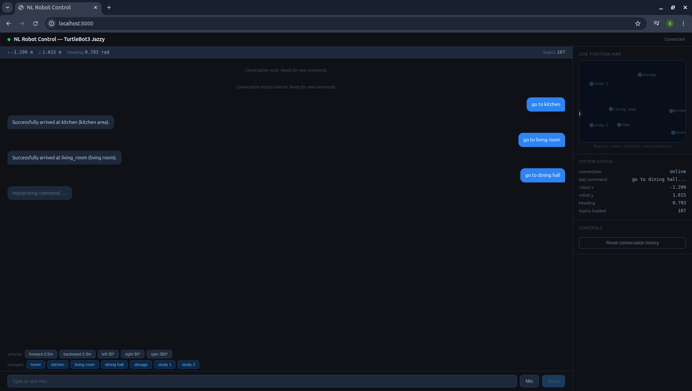
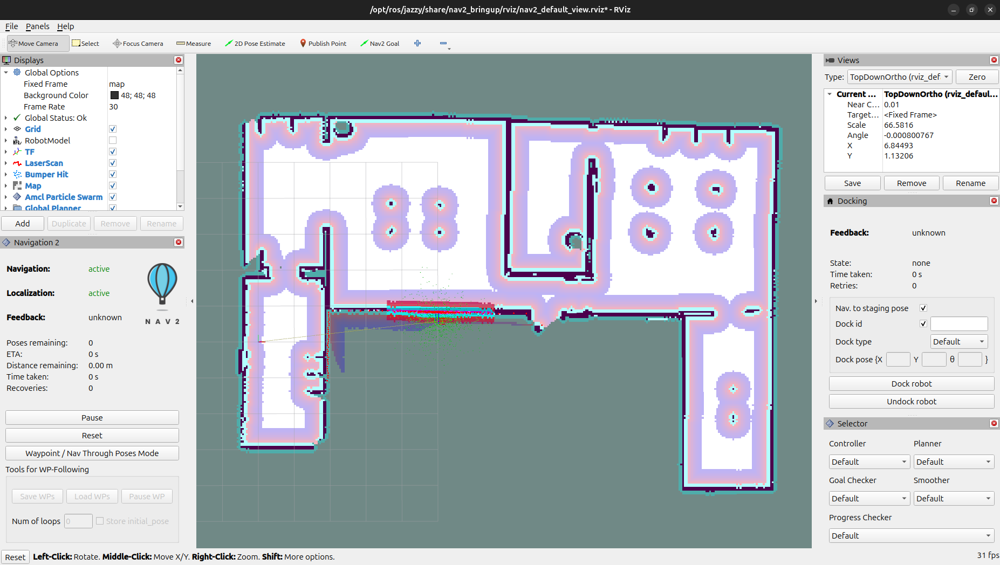
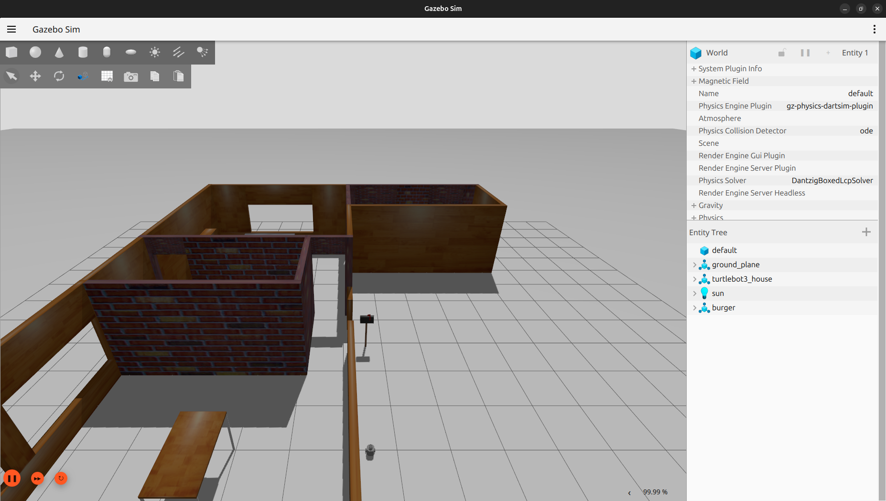

# 🤖 Natural Language Robot Control

> Control a TurtleBot3 robot using plain English — type or speak your command,
> and the robot navigates autonomously using ROS2 Jazzy, Nav2, and Claude AI.


---

## 📋 Overview

This project builds a complete natural language interface for autonomous robot
control. A user can command a TurtleBot3 Burger in plain English for example
**"go to the kitchen"** or **"turn left 90 degrees"** using either typed text
or voice input directly in the browser.

The system interprets user intent using Claude AI's `tool_use` API, discovers
available ROS2 topics dynamically at startup, and routes commands to either
direct velocity control (`/cmd_vel`) or Nav2 autonomous path planning with
real-time obstacle avoidance.
---

## 🏗️ System Architecture

```
User (text or voice)
        ↓
   Chat UI — browser          ←──── Live robot state pushed every 1s
        ↓  WebSocket
   FastAPI Server (uvicorn)
        ↓
   LLM Intent Engine — Claude claude-sonnet-4-5
        │
        ├── tool: publish_command
        │       ↓
        │   Safety Layer (velocity clamp + topic whitelist)
        │       ↓
        │   roslibpy → rosbridge ws://localhost:9090
        │       ↓
        │   /cmd_vel (geometry_msgs/TwistStamped)
        │       ↓
        │   Gazebo motor controller → robot moves
        │
        └── tool: navigate_to_location
                ↓
            rclpy Nav2Client
                ↓
            /navigate_to_pose action server
                ↓
            Nav2 (global planner + local planner + AMCL)
                ↓
            Robot navigates with obstacle avoidance
```

---

## ✨ Features

- **Natural language understanding**: Claude AI interprets free-form English commands
- **Dual navigation modes**: velocity commands for short moves, Nav2 for room-to-room navigation
- **Voice input**: speak commands directly in the browser via Web Speech API (no external service)
- **Live mini-map**: real-time robot position plotted against all named room locations
- **Semantic location map**: define named rooms (kitchen, living room, dining hall, etc.)
- **Dynamic topic discovery**: LLM receives the live ROS2 topic list at startup, works with any robot
- **Safety layer**: velocity clamping, topic whitelisting, duration limits before every command
- **Multi-turn conversation**: context-aware follow-ups ("go back", "now turn around")
- **Auto-reconnect**: UI automatically recovers from server restarts or network drops
- **Conversation reset**: clear LLM context with one button for a fresh session

---

## 🖥️ Screenshots

| Chat UI with voice input | RViz map + costmap | Gazebo simulation |
|:---:|:---:|:---:|
|  |  |  |

---

## 🛠️ Tech Stack

| Layer | Technology |
|---|---|
| Robot platform | TurtleBot3 Burger |
| Robot OS | ROS2 Jazzy |
| Simulation | Gazebo (gz-sim) |
| ROS2 ↔ Web bridge | rosbridge_suite + roslibpy |
| Autonomous navigation | Nav2 (NavigateToPose action server) |
| Map building | SLAM Toolbox (online async) |
| Localisation | AMCL (Adaptive Monte Carlo Localisation) |
| LLM | Claude claude-sonnet-4-5 (Anthropic) via tool_use |
| Backend | FastAPI + uvicorn + asyncio |
| Frontend | Vanilla HTML/CSS/JS + Web Speech API + Canvas mini-map |

---

## 📁 Project Structure

```
nl_robot_control/
├── core/
│   ├── bridge_client.py    # ROS2 ↔ WebSocket bridge via roslibpy
│   ├── llm_engine.py       # Claude API + tool_use intent engine
│   ├── safety.py           # Velocity clamping + topic whitelist + duration limits
│   ├── nav2_client.py      # Nav2 NavigateToPose rclpy action client
│   └── locations.json      # Named room coordinates in map frame (amcl_pose)
├── api/
│   └── server.py           # FastAPI WebSocket server + robot state streaming
├── static/
│   └── index.html          # Chat UI + voice input + canvas mini-map
├── tests/
│   └── test_llm_engine.py  # CLI test harness for LLM + bridge pipeline
├── media/                  # Screenshots and demo GIF
│   ├── demo.gif
│   ├── ui_screenshot.png
│   ├── rviz_map.png
│   └── gazebo.png
├── .env.example            # Template for API key setup
├── .gitignore
├── requirements.txt
└── README.md
```

---

## ⚙️ Prerequisites

Make sure the following are installed before proceeding:

- **Ubuntu 24.04**
- **ROS2 Jazzy** — [Installation guide](https://docs.ros.org/en/jazzy/Installation.html)
- **TurtleBot3 packages**
  ```bash
  sudo apt install ros-jazzy-turtlebot3*
  export TURTLEBOT3_MODEL=burger
  ```
- **Nav2**
  ```bash
  sudo apt install ros-jazzy-navigation2 ros-jazzy-nav2-bringup
  ```
- **SLAM Toolbox**
  ```bash
  sudo apt install ros-jazzy-slam-toolbox
  ```
- **rosbridge suite**
  ```bash
  sudo apt install ros-jazzy-rosbridge-suite
  ```
- **Python 3.10+**
- **Anthropic API key** — get one at [console.anthropic.com](https://console.anthropic.com)

---

## 🚀 Installation

### 1. Clone the repository

```bash
git clone https://github.com/Sammykrishna/nl-robot-control.git
cd nl-robot-control
```

### 2. Install Python dependencies

```bash
pip install -r requirements.txt
```

### 3. Set up your API key

```bash
cp .env.example .env
```

Open `.env` and add your Anthropic API key:


### 4. Build your map (first time only)

**Terminal 1 — Launch Gazebo:**
```bash
source /opt/ros/jazzy/setup.bash
export TURTLEBOT3_MODEL=burger
ros2 launch turtlebot3_gazebo turtlebot3_house.launch.py
```

**Terminal 2 — Launch SLAM:**
```bash
source /opt/ros/jazzy/setup.bash
ros2 launch slam_toolbox online_async_launch.py use_sim_time:=true
```

**Terminal 3 — Drive the robot to build the map:**
```bash
source /opt/ros/jazzy/setup.bash
ros2 run teleop_twist_keyboard teleop_twist_keyboard \
    --ros-args -p stamped:=true
```

Drive slowly through every room. When the map is complete:

```bash
mkdir -p ~/maps
ros2 run nav2_map_server map_saver_cli -f ~/maps/my_map
```

### 5. Record named location coordinates

Drive the robot to each named location, stop completely, then run:

```bash
ros2 topic echo /amcl_pose --once
```

Update `core/locations.json` with the `x`, `y` values and yaw
(computed as `2 × arctan2(orientation.z, orientation.w)`).

> ⚠️ Always use `/amcl_pose` (map frame), not `/odom` (robot-relative frame).
> Nav2 uses map frame coordinates exclusively.

---

## ▶️ Running the System

Open **5 terminals** and run each in order:

```bash
# Terminal 1 — Gazebo simulation
source /opt/ros/jazzy/setup.bash
export TURTLEBOT3_MODEL=burger
ros2 launch turtlebot3_gazebo turtlebot3_house.launch.py

# Terminal 2 — rosbridge WebSocket server
source /opt/ros/jazzy/setup.bash
ros2 launch rosbridge_server rosbridge_websocket_launch.xml

# Terminal 3 — Nav2 with your saved map
source /opt/ros/jazzy/setup.bash
ros2 launch nav2_bringup bringup_launch.py \
    map:=$HOME/maps/my_map.yaml use_sim_time:=true

# Terminal 4 — RViz (set 2D Pose Estimate once after each launch)
source /opt/ros/jazzy/setup.bash
ros2 run rviz2 rviz2 \
    -d $(ros2 pkg prefix nav2_bringup)/share/nav2_bringup/rviz/nav2_default_view.rviz

# Terminal 5 — FastAPI chat server
cd nl_robot_control
source /opt/ros/jazzy/setup.bash
uvicorn api.server:app --host 0.0.0.0 --port 8000 --reload
```

Then open **http://localhost:8000** in **Chrome** (required for voice input).

> After launching Nav2 and RViz, click **"2D Pose Estimate"** in RViz and
> click the robot's actual position on the map to initialise AMCL localisation.
> This must be done once after every Nav2 launch.

---

## 🗣️ Usage Examples

### Velocity commands (direct motor control)
```
"move forward 1 meter"
"turn left 90 degrees"
"turn right 45 degrees"
"go backward 0.5 meters"
"spin 360 degrees"
"go forward slowly"
```

### Navigation commands (Nav2 autonomous)
```
"go to the kitchen"
"navigate to the dining hall"
"return home"
"go to study room 1"
"take me to the living room"
"go to storage room"
```

### Voice commands
Click the **Mic** button and speak any of the above commands.
The browser transcribes your speech in real time and sends it automatically.

### Follow-up commands (multi-turn context)
```
You:   "go to the kitchen"
Robot: "Arrived at kitchen."
You:   "now turn left"           ← understands context
You:   "go back to where we started"
```

---

## 🔒 Safety System

Every command passes through `core/safety.py` before reaching the robot:

| Parameter | Limit | Reason |
|---|---|---|
| Max linear velocity | 0.20 m/s | TurtleBot3 Burger hardware limit |
| Max angular velocity | 1.0 rad/s | Stable turning without tip risk |
| Max command duration | 10.0 seconds | Prevents runaway open-loop commands |
| Allowed topics | `/cmd_vel` only | LLM cannot publish to arbitrary topics |

Velocity values are **clamped** (not rejected) so the robot always moves
safely even if the LLM computes an aggressive value. Duration overflows
are **rejected** with an error message returned to the user.

---

## 🧠 How the LLM Intent Engine Works

### Tool selection

Claude receives a system prompt containing:
- Live ROS2 topic manifest (from `/rosapi/topics` via rosbridge)
- Current robot state (x, y, heading from `/odom`)
- Named locations list (from `locations.json`)
- Robot specs and safety limits

It then selects between two registered tools:

| Tool | Triggered by | Execution |
|---|---|---|
| `publish_command` | Distance/angle commands | Publishes `TwistStamped` to `/cmd_vel` for computed duration |
| `navigate_to_location` | Named place commands | Sends `NavigateToPose` goal to Nav2 action server |

### Duration computation (publish_command)

```
Distance command:  duration = distance_m / speed_mps   (default speed: 0.15 m/s)
Rotation command:  duration = degrees × (π/180) / angular_vel  (default: 0.5 rad/s)
```

### Why tool_use instead of freeform text?

Tool use forces Claude to respond with a validated JSON structure rather than
freeform text. This means the velocity and topic values are always correctly
typed and structured — no string parsing, no regex, no hallucinated field names.

---

## 🗺️ Named Locations

Edit `core/locations.json` to define your own rooms:

```json
{
  "kitchen": {
    "x": 12.850,
    "y": 1.882,
    "yaw": 1.570,
    "description": "kitchen area near counter"
  },
  "living_room": {
    "x": 3.749,
    "y": 2.046,
    "yaw": 1.570,
    "description": "living room"
  }
}
```

Coordinates are in the **map frame** — record them using:
```bash
ros2 topic echo /amcl_pose --once
```

Yaw conversion from quaternion: `yaw = 2 × arctan2(orientation.z, orientation.w)`

---

## 🐛 Common Issues

| Problem | Cause | Fix |
|---|---|---|
| Robot doesn't move with teleop | `/cmd_vel` expects `TwistStamped` not `Twist` | Add `--ros-args -p stamped:=true` to teleop launch |
| Navigation fails with status 6 | Wrong coordinates or goal inside wall | Re-record coordinates using `/amcl_pose`, not `/odom` |
| `map → base_link` transform missing | AMCL not initialised | Set 2D Pose Estimate in RViz after Nav2 launch |
| `model: claude-sonnet-4-20250514` not found | Wrong model string | Use `claude-sonnet-4-5` |
| rosbridge publish error — cannot infer type | Missing advertise step | roslibpy handles this automatically |
| Subscription count 0 on `/cmd_vel` | ROS2 controller bridge not started | Use full `turtlebot3_house.launch.py`, not Gazebo standalone |

---

## 📦 Dependencies

```
# Python packages (requirements.txt)
anthropic          # Claude API with tool_use support
fastapi            # Async web framework
uvicorn            # ASGI server
roslibpy           # Python WebSocket client for rosbridge
websockets         # WebSocket support
python-dotenv      # .env file loading
python-multipart   # FastAPI form handling
jinja2             # HTML templating

# ROS2 packages (apt)
ros-jazzy-rosbridge-suite
ros-jazzy-navigation2
ros-jazzy-nav2-bringup
ros-jazzy-slam-toolbox
ros-jazzy-turtlebot3
ros-jazzy-turtlebot3-simulations
```

---

## 🔭 Future Work

- [ ] Add a real physical TurtleBot3 (replace `use_sim_time:=true`)
- [ ] Camera integration — "go to the person in the red shirt"
- [ ] Multi-robot support — command multiple robots simultaneously
- [ ] Web-based map editor — define room locations visually without CLI
- [ ] GPT-4o / local LLM (Ollama) as alternative backend
- [ ] Docker Compose to launch all 5 terminals with one command
- [ ] Natural language waypoint sequences — "patrol the house"

---

## 📄 License

MIT License — see [LICENSE](LICENSE) for details.

---

## 🙏 Acknowledgements

- [Anthropic](https://anthropic.com) — Claude AI API
- [ROS2 community](https://ros.org) — Nav2, rosbridge, TurtleBot3 packages
- [ROBOTIS](https://www.robotis.com) — TurtleBot3 platform and simulation

---

## 👤 Author

**Samanth Krishna**
Master's student — Mechatronics Engineering
RWU Hochschule Ravensburg-Weingarten, Germany

[](https://github.com/Sammykrishna)